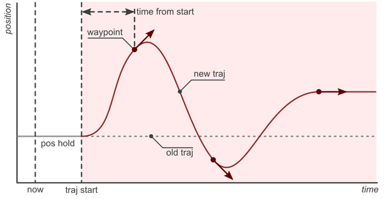
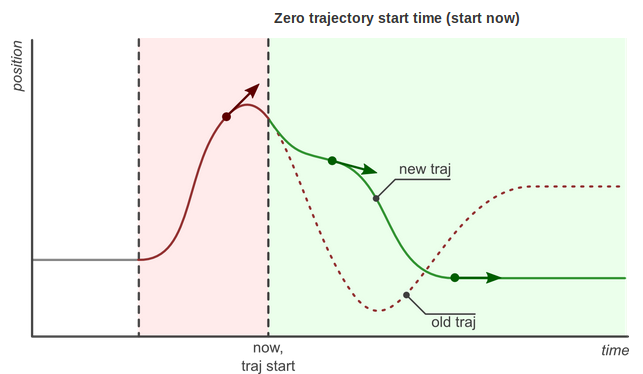
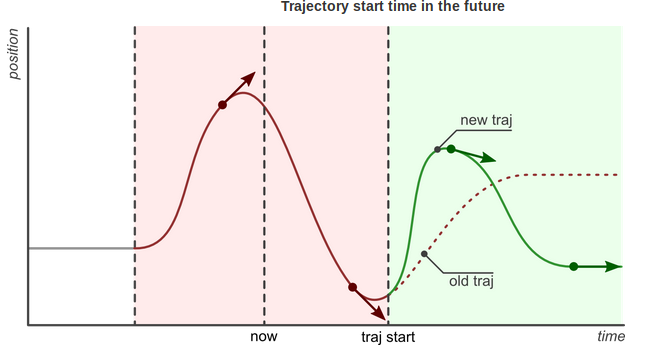
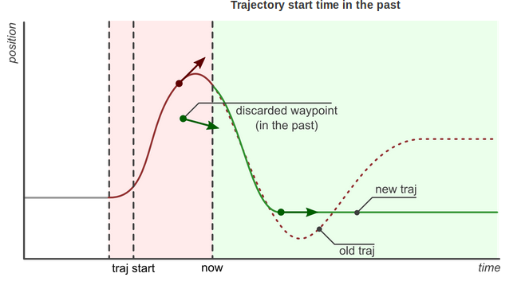

# Understanding Trajectory Replacement
軌道の切り替えについての理解

[joint trajectory controller](joint_trajectory_controller.md)で説明したとおり
新しい軌道コマンドの到着は**必ずしも**コントローラが完全に現在実行中の軌道を捨て去り，
そして新しい軌道を実行し始めることを意味しません．
むしろ，コントローラは両方の軌道で利用できそうな部分を抜き取り，そして適切に組み合わせます.
これにより，よりスマートな軌道置換行います．

以下がコントローラが行う軌道置換のステップです．

- 新しい軌道の中から使えそうな部分を得る．

	:	未来に到達すべき全ての経由点を保存し，過去に到達すべきだったものを破棄します．
	有用な部分がない場合（つまり，すべての経由点が過去にある場合），新しい軌道は
	拒否され，現在の軌道は変更されずに実行を続けます．

- 現在の軌道の中から使えそうな部分を得る．

	:	新しい軌道の開始時刻まで現在の軌道を保存し，それより後の部分の軌道は捨てます．

- 使えそうな部分を組み合わせます．

	:	現在の軌道と新しい軌道の使えそうな部分を組み合わせます．

下記の例はこの振る舞いを詳細に説明しています．

## 1. 基本
この例は，現在，ジョイントが位置保存モード(下の図ではpos holdと書かれた平らな灰色の直線)
にある場合を仮定します．
新しい軌道(赤で示されています）が今(now)，到着しました．その軌跡は３つの経由点と
未来の開始時刻(traj start)で構成されています．
この経由点に到達すべき時刻(
[trajectory_msgs/JointTrajectoryPoint](http://docs.ros.org/api/trajectory_msgs/html/msg/JointTrajectoryPoint.html)
の中のtime_from_startメンバによって指定
)は軌道の開始時刻から相対的に計算されたものです．

コントローラは開始時刻(traj start)で現在の軌道を繋ぎ合わせを行います．
そして，３つの経由点を追加します．
現在(now)と開始時刻(traj start)までの間では以前の位置が維持されていることに
気をつけてください．この時点では，新しい軌道は，まだ開始されません．
最後の経由点に到達した後，その位置は新しいコマンドが到着するまで保持されます．

コントローラは現在と新しい軌道の間の推移がスムーズであることを保証します．
これは，最初の経由点に到達するまでの時間がより長い場合は，推移がゆっくりになることを意味します．

## 2. 軌道開始時刻の効果
この例では，同じ軌道を異なる開始時刻(start time)でコントローラに送った場合の効果について
説明しています．状況としては，コントローラは上述の例の軌道(赤のライン)を実行中に，
新しいコマンド(緑のライン)を受け取ったところです．ただ，そのコマンドの開始時刻は
それぞれ，０(start now)，未来の時刻，過去の時刻となっています．

最後の図(Trajectory start time in the past)において，
最も興味深いことは，新しい軌道の開始時刻と最初の経由点の到達時刻は
すでに過ぎ去ってしまっているということです．
この場合，最初の経由点は捨てられ，２つ目の経由点のみが実行されます．

 
 
 

 
 
 

